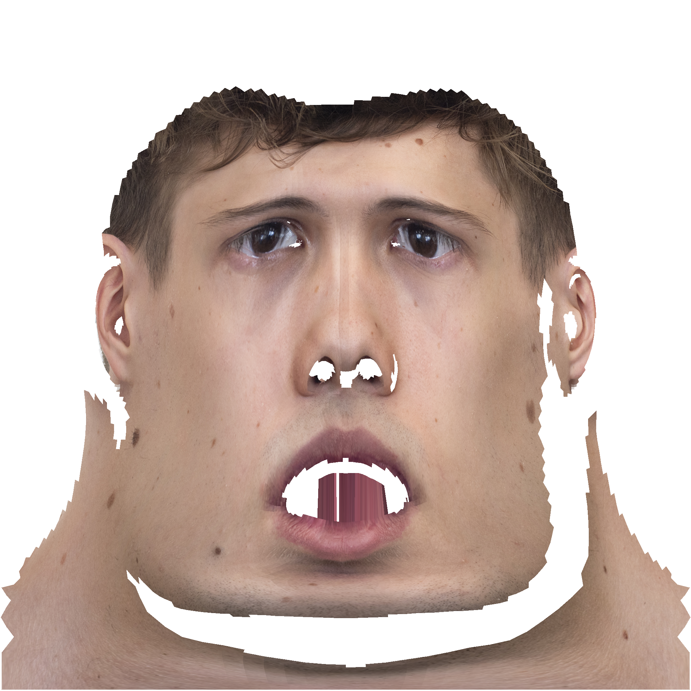
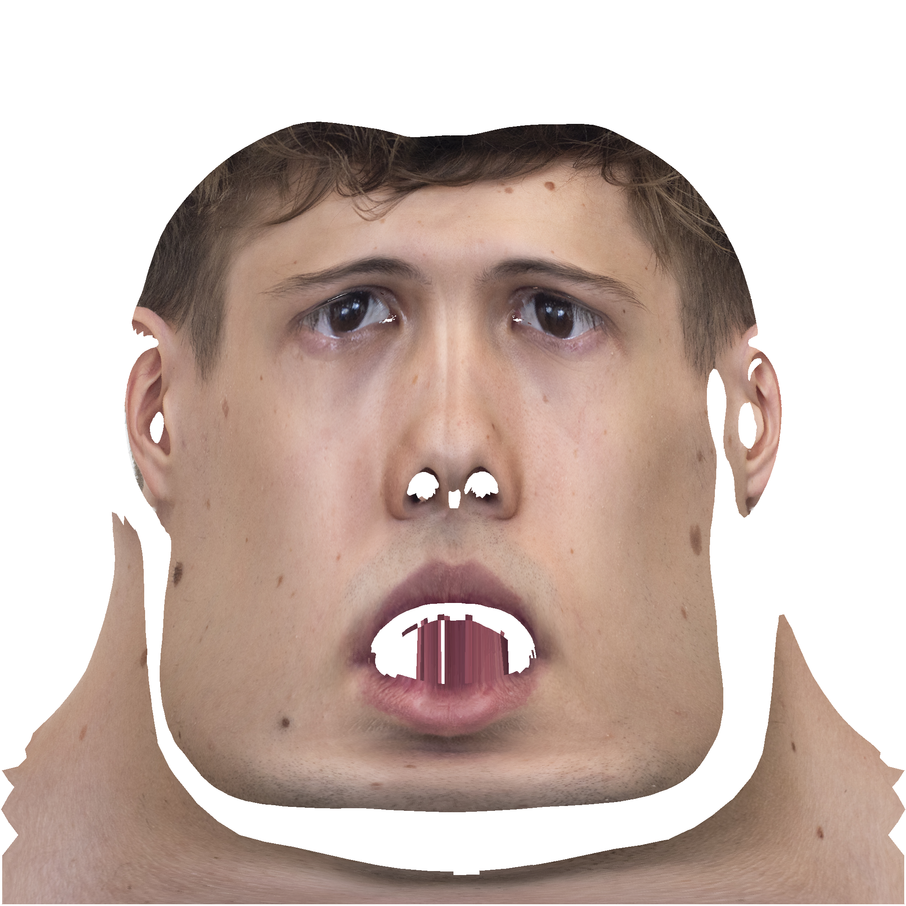
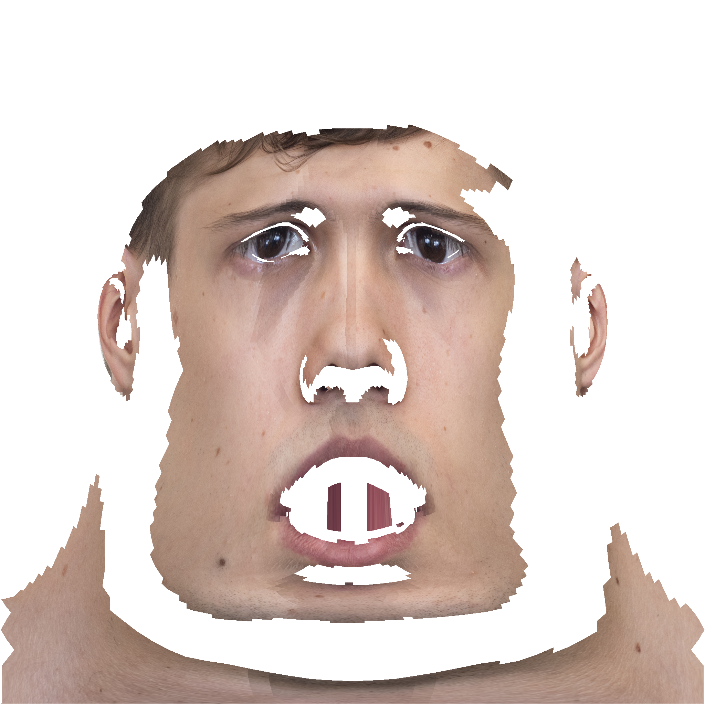
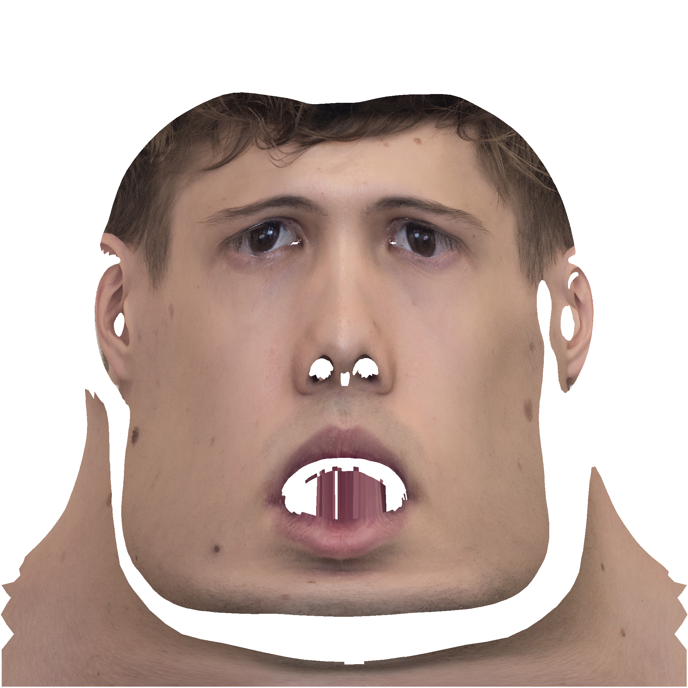
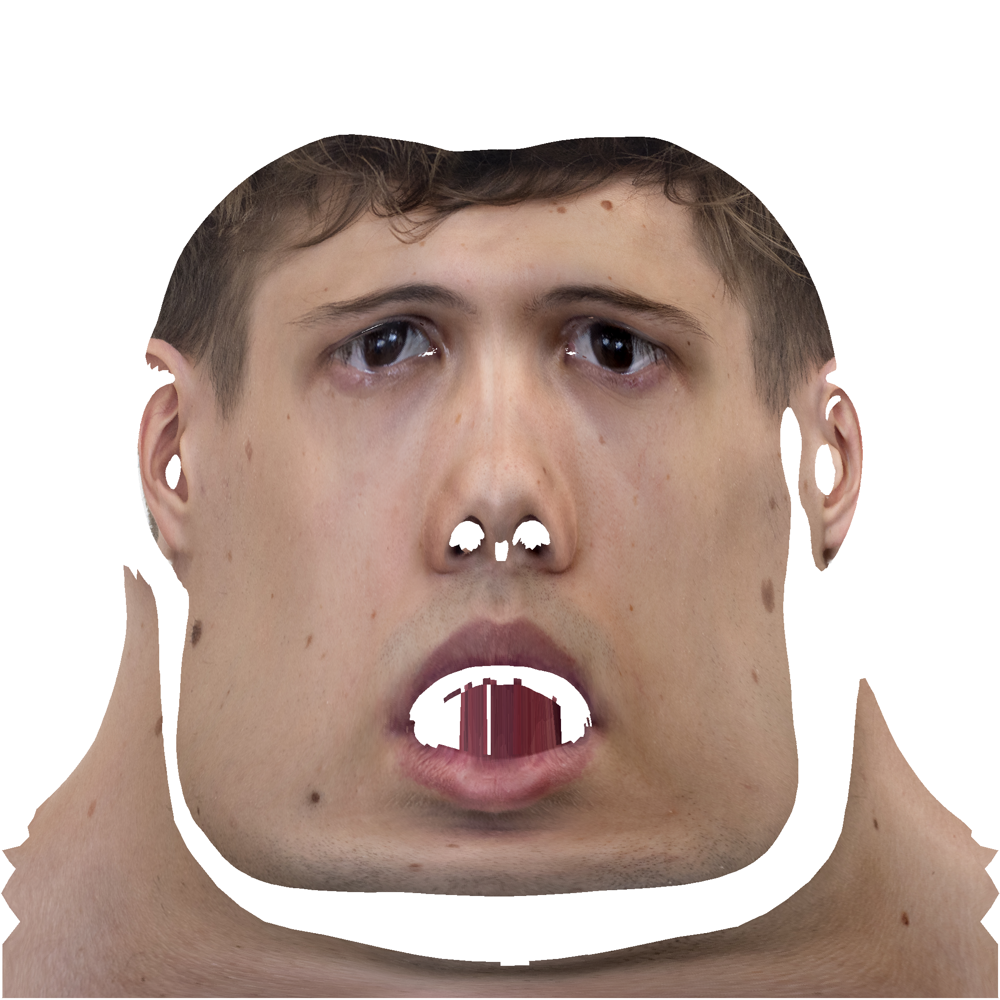
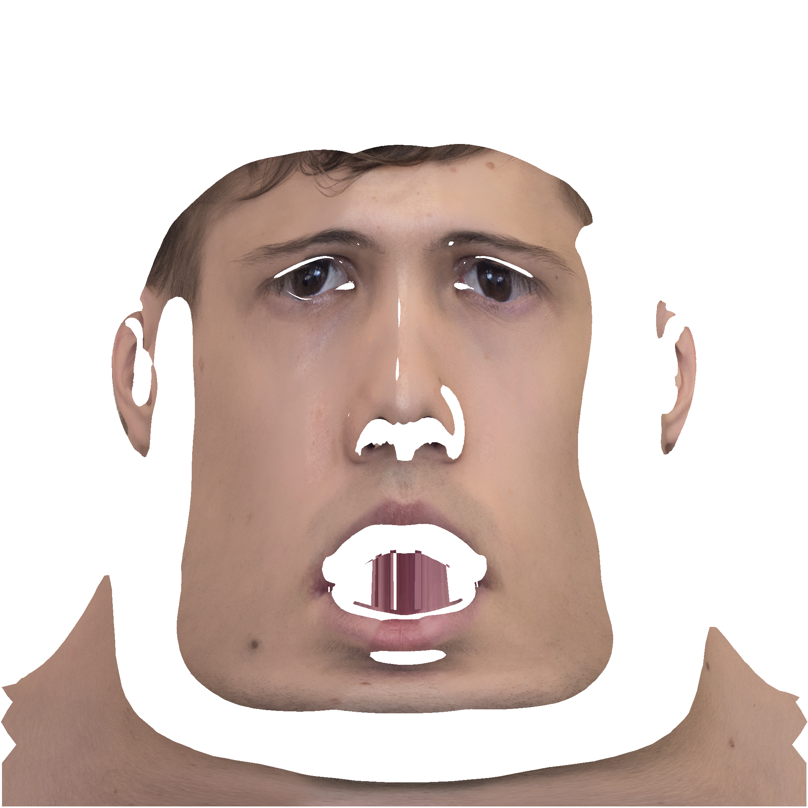
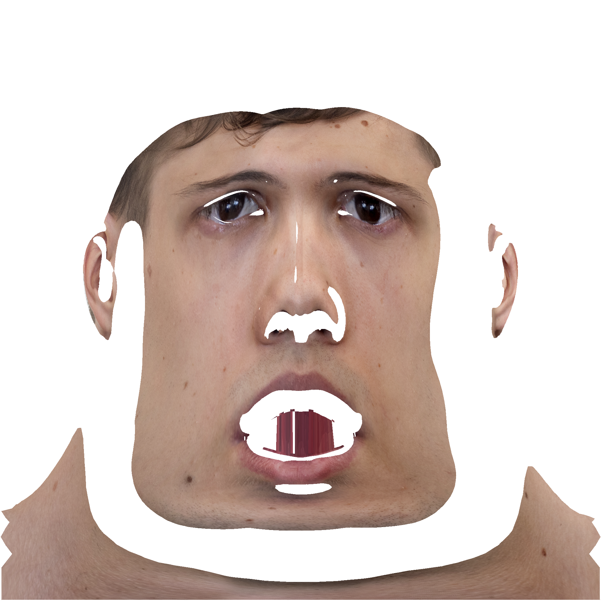

# Texture Correction

## Normals

### angle affection = 20

    
    

### angle affection = 50

    
    

## Equalization

### angle affection = 20

#### no equalization

#### diff

    
    

### angle affection = 50

#### no equalization

#### diff

    
    

### color artifact (green shadow)

